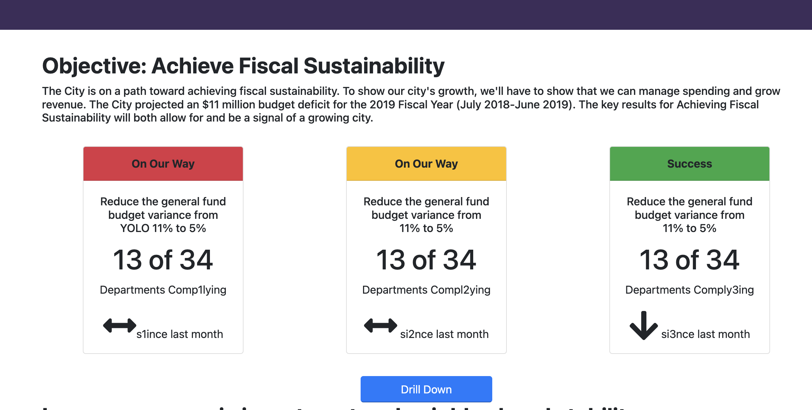
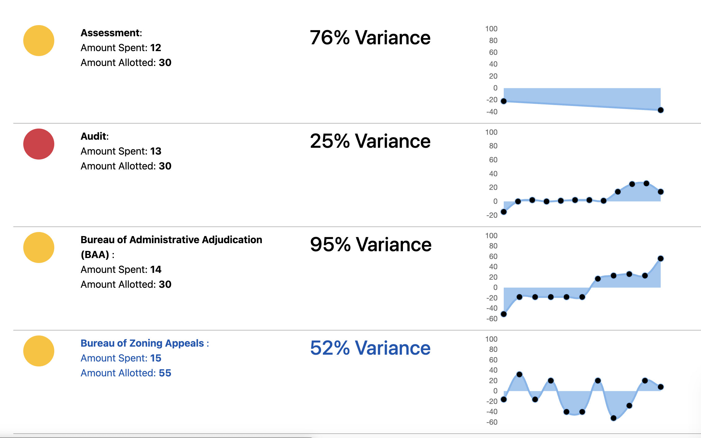

# SyracuseDashboardv3

This is a JavaScript version of the Syracuse Dashboard Test. NOTE: THIS WEBSITE USES SAMPLE DATA! THIS DOES NOT REPRESENT REAL LIFE.

### tech stack

CSS:
Bootstrap + Bootstrap.Native to replace dependency on JQuery

JS:
ChartJS, D3Array + D3DSV, Vanilla

### This is what the homepage looks like:

The arrows are dynamically created on the home page. 

The charts are made with ChartJS on the drill down pages

